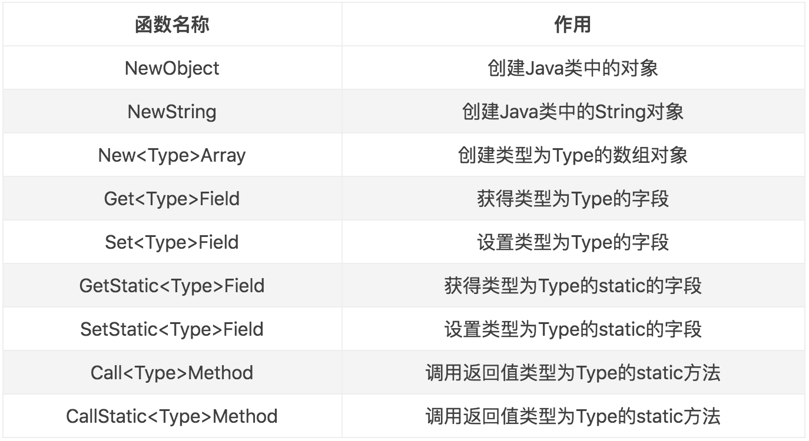

## JNI （Java Native Interface）

- 提供一种Java字节码调用C/C++的解决方案，JNI描述的是一种技术

### Java和Native之间基本数据类型转换

| Java类型 | JNI类型 |
| :--------: | :-------: |
|	byte |	jbyte	|
|	char |	jchar	|
|	short |	jshort	|
|	int |	jint	|
|	long |	jlong	|
|	float |	jfloat	|
|	double |	jdouble	|
|	boolean |	jboolean	|

### Java和Native之间引用数据类型转换

| Java类型 | JNI 类型 |
| :--------: | :--------: |
| All objects | jobject |
| java.lang.String | jstring |
| java.lang.Class | jclass |
| java.lang.Throwable | jthrowable |
| Object[ ] | jobjectArray[ ] |
| boolean[ ] | jbooleanArray[ ] |
| byte[ ] | jbyteArray[ ] |
| char[ ] | jcharArray[ ] |
| short[ ] | jshortArray[ ] |
| int[ ] | jintArray[ ] |
| long[ ] | jlongArray[ ] |
| float[ ] | jfloatArray[ ] |
| double[ ] | jdoubleArray[ ] |

### Native方法语句分析

```c++
extern "C" JNIEXPORT jstring JNICALL
Java_com_zqf_jnitest_MainActivity_stringFromJNI(JNIEnv *env, jobject /* this */) {
    std::string hello = "Hello NDK";
    return env->NewStringUTF(hello.c_str());
}
```

- **extern “C”  作用：避免编绎器按照C++的方式去编绎C函数**

  1、C不支持函数的重载，编译之后函数名不变；

  2、C++支持函数的重载（这点与Java一致），编译之后函数名会改变；

- JNIEXPORT ：用来表示该函数是否可导出（即：方法的可见性）

  1、宏 JNIEXPORT 代表的就是右侧的表达式： __attribute__ ((visibility ("default")))；
  2、或者也可以说： JNIEXPORT 是右侧表达式的别名；
  3、宏可表达的内容很多，如：一个具体的数值、一个规则、一段逻辑代码等；

- JNICALL ：用来表示函数的调用规范（如：__stdcall）

### JNIEnv

- JNIEnv代表了Java环境（通过**JNIEnv***就可以对Java端的代码进行操作）：
  1、创建Java对象
  2、调用Java对象的方法
  3、获取Java对象的属性等
- Native定义的函数名称作用于Java代表的意思



### jclass、jobject

- **jclass     定义native函数的Java类 
  jobject   定义native函数的Java类的实例**

### CMake语法

- 添加源文件或库 **add_library(x y z)**

- 链接 target_link_libraries